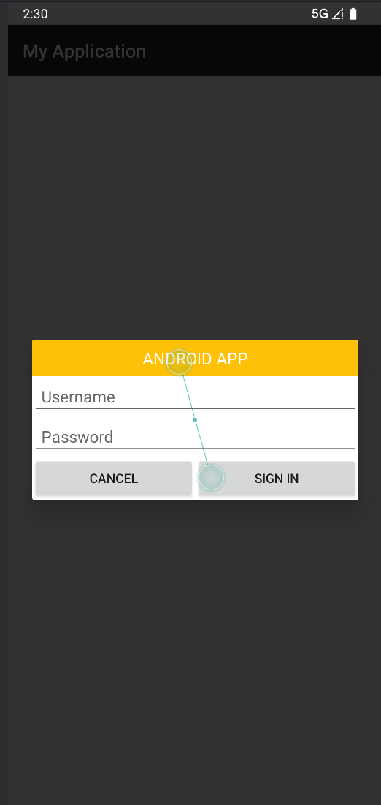

# 实验三：Android 组件与交互界面开发

姓名：张博凯 
班级：软工2班 
学号：121052023047

## 一、实验目的

1. 掌握 ListView 列表组件的使用方法，实现图文列表展示
2. 学会使用 AlertDialog 构建自定义对话框，实现用户交互
3. 理解 ActionMode 上下文操作模式的实现逻辑，掌握列表项长按操作
4. 熟悉 Android 菜单系统（OptionsMenu）的开发与事件处理
5. 掌握 Activity 之间的跳转与数据传递方式
6. 了解 Notification 通知组件的基本使用

## 二、实验环境

- 操作系统：Windows 10/11
- 开发工具：Android Studio Hedgehog | 2023.1.1
- 模拟器：Pixel 7 API 34
- JDK 版本：17.0.9
- 测试设备：Android 14 模拟器

## 三、实验内容与步骤

### 3.1 主界面设计（MainActivity）

主界面作为应用入口，通过按钮跳转至其他功能页面，布局文件 `activity_main.xml` 关键代码：

```xml
<LinearLayout xmlns:android="http://schemas.android.com/apk/res/android"
    android:layout_width="match_parent"
    android:layout_height="match_parent"
    android:orientation="vertical"
    android:gravity="center"
    android:padding="20dp">

    <Button
        android:id="@+id/btn_listview"
        android:layout_width="wrap_content"
        android:layout_height="wrap_content"
        android:text="ListView 页面"
        android:layout_marginBottom="20dp"/>

    <Button
        android:id="@+id/btn_alert_dialog"
        android:layout_width="wrap_content"
        android:layout_height="wrap_content"
        android:text="自定义 AlertDialog 页面"
        android:layout_marginBottom="20dp"/>

    <Button
        android:id="@+id/btn_menu"
        android:layout_width="wrap_content"
        android:layout_height="wrap_content"
        android:text="XML 菜单页面"/>

    <Button
        android:id="@+id/btn_action_mode"
        android:layout_width="wrap_content"
        android:layout_height="wrap_content"
        android:text="ActionMode 页面"
        android:layout_marginTop="20dp"/>
</LinearLayout>
```

主活动代码（`MainActivity.java`）通过 `Intent` 实现页面跳转：

```java
// 示例：ListView页面跳转
listViewBtn.setOnClickListener(v -> {
    Intent intent = new Intent(MainActivity.this, ListViewActivity.class);
    startActivity(intent);
});
```

### 3.2 ListView 列表展示与通知功能

实现包含图片和文字的列表，点击列表项弹出通知。

#### 3.2.1 列表项布局（`list_item.xml`）

```xml
<LinearLayout xmlns:android="http://schemas.android.com/apk/res/android"
    android:layout_width="match_parent"
    android:layout_height="wrap_content"
    android:padding="10dp"
    android:orientation="horizontal"
    android:gravity="center_vertical">

    <ImageView
        android:id="@+id/iv_animal_image"
        android:layout_width="50dp"
        android:layout_height="50dp"
        android:scaleType="centerCrop"/>

    <TextView
        android:id="@+id/tv_animal_name"
        android:layout_width="wrap_content"
        android:layout_height="wrap_content"
        android:layout_marginStart="15dp"
        android:textSize="18sp"/>
</LinearLayout>
```

#### 3.2.2 ListView 逻辑实现（`ListViewActivity.java`）

- 使用 `SimpleAdapter` 绑定数据与列表
- 点击列表项触发通知功能（适配 Android O 及以上的通知渠道）

核心代码：

```java
// 初始化数据
int[] images = {R.drawable.lion, R.drawable.tiger, R.drawable.monkey, 
               R.drawable.dog, R.drawable.cat, R.drawable.elephant};
String[] names = {"Lion", "Tiger", "Monkey", "Dog", "Cat", "Elephant"};

// 构建数据列表
for (int i = 0; i < names.length; i++) {
    Map<String, Object> map = new HashMap<>();
    map.put("name", names[i]);
    map.put("image", images[i]);
    dataList.add(map);
}

// 绑定适配器
SimpleAdapter adapter = new SimpleAdapter(this, dataList, R.layout.list_item,
        new String[]{"name", "image"},
        new int[]{R.id.tv_animal_name, R.id.iv_animal_image});
listView.setAdapter(adapter);

// 点击事件与通知发送
listView.setOnItemClickListener((parent, view, position, id) -> {
    String animalName = (String) dataList.get(position).get("name");
    // 通知渠道创建（Android O+）
    if (Build.VERSION.SDK_INT >= Build.VERSION_CODES.O) {
        NotificationChannel channel = new NotificationChannel(
            "channel_id", "Animal Channel", NotificationManager.IMPORTANCE_DEFAULT);
        notificationManager.createNotificationChannel(channel);
    }
    // 构建通知
    NotificationCompat.Builder builder = new NotificationCompat.Builder(this, "channel_id")
            .setSmallIcon(R.mipmap.ic_launcher)
            .setContentTitle(animalName)
            .setContentText("这是关于" + animalName + "的通知")
            .setPriority(NotificationCompat.PRIORITY_DEFAULT);
    notificationManager.notify(position, builder.build());
});
```

### 3.3 自定义 AlertDialog 对话框

实现包含用户名、密码输入框的自定义登录对话框。

#### 3.3.1 对话框布局（`dialog_custom.xml`）

```xml
<LinearLayout xmlns:android="http://schemas.android.com/apk/res/android"
    android:layout_width="match_parent"
    android:layout_height="wrap_content"
    android:orientation="vertical">

    <TextView
        android:layout_width="match_parent"
        android:layout_height="40dp"
        android:background="#FFC107"
        android:gravity="center"
        android:text="ANDROID APP"
        android:textColor="#FFFFFF"/>

    <EditText
        android:id="@+id/et_username"
        android:layout_width="match_parent"
        android:layout_height="wrap_content"
        android:hint="Username"
        android:padding="10dp"/>

    <EditText
        android:id="@+id/et_password"
        android:layout_width="match_parent"
        android:layout_height="wrap_content"
        android:hint="Password"
        android:inputType="textPassword"/>

    <LinearLayout
        android:layout_width="match_parent"
        android:layout_height="wrap_content"
        android:orientation="horizontal">
        <Button android:id="@+id/btn_cancel" ... />
        <Button android:id="@+id/btn_sign_in" ... />
    </LinearLayout>
</LinearLayout>
```

#### 3.3.2 对话框逻辑（`AlertDialogActivity.java`）

通过 `AlertDialog.Builder` 加载自定义布局，实现登录按钮点击事件：

```java
Button showDialogBtn = findViewById(R.id.btn_show_dialog);
showDialogBtn.setOnClickListener(v -> {
    View customView = LayoutInflater.from(this).inflate(R.layout.dialog_custom, null);
    EditText usernameEt = customView.findViewById(R.id.et_username);
    EditText passwordEt = customView.findViewById(R.id.et_password);
    
    AlertDialog dialog = new AlertDialog.Builder(this)
            .setView(customView)
            .create();

    // 登录按钮点击事件
    customView.findViewById(R.id.btn_sign_in).setOnClickListener(v1 -> {
        String username = usernameEt.getText().toString();
        String password = passwordEt.getText().toString();
        Toast.makeText(this, "用户名：" + username + "，密码：" + password, Toast.LENGTH_SHORT).show();
        dialog.dismiss();
    });
    dialog.show();
});
```

### 3.4 ActionMode 上下文操作模式

实现列表项长按触发上下文菜单（删除功能）。

核心代码（`ActionModeActivity.java`）：

```java
// 长按列表项触发ActionMode
listView.setOnItemLongClickListener((parent, view, position, id) -> {
    if (actionMode != null) return false;
    selectedPosition = position;
    actionMode = startActionMode(actionModeCallback); // 启动上下文模式
    view.setSelected(true);
    return true;
});

// ActionMode回调实现
private ActionMode.Callback actionModeCallback = new ActionMode.Callback() {
    @Override
    public boolean onCreateActionMode(ActionMode mode, Menu menu) {
        getMenuInflater().inflate(R.menu.context_menu, menu); // 加载菜单资源
        mode.setTitle("1 selected");
        return true;
    }

    @Override
    public boolean onActionItemClicked(ActionMode mode, MenuItem item) {
        if (item.getItemId() == R.id.action_delete) {
            dataList.remove(selectedPosition); // 删除选中项
            adapter.notifyDataSetChanged();
            mode.finish(); // 关闭上下文模式
            return true;
        }
        return false;
    }

    @Override
    public void onDestroyActionMode(ActionMode mode) {
        actionMode = null; // 清理资源
        selectedPosition = -1;
    }
};
```

### 3.5 选项菜单（OptionsMenu）

实现文本大小调整、颜色修改等菜单功能。

菜单资源（`menu/menu_main.xml`）定义菜单项，活动代码（`MenuActivity.java`）处理菜单点击：

```java
@Override
public boolean onCreateOptionsMenu(Menu menu) {
    getMenuInflater().inflate(R.menu.menu_main, menu); // 加载菜单
    return true;
}

@Override
public boolean onOptionsItemSelected(@NonNull MenuItem item) {
    int itemId = item.getItemId();
    if (itemId == R.id.item_font_small) {
        tvTest.setTextSize(10); // 调整文本大小
    } else if (itemId == R.id.item_color_red) {
        tvTest.setTextColor(Color.RED); // 修改文本颜色
    }
    // 其他菜单项处理...
    return true;
}
```

## 四、实验结果

1. **主界面**：四个功能按钮整齐排列，点击可分别跳转至对应页面。
2. **ListView 页面**：
   - 显示 6 个动物的图文列表（图片 + 名称）
   - 点击任意列表项，系统状态栏弹出对应动物的通知
   - 
3. **自定义对话框**：
   - 点击按钮弹出包含用户名、密码输入框的登录对话框
   - 输入内容后点击 "Sign in"，Toast 提示输入的账号密码
   - 
4. **ActionMode 页面**：
   - 长按列表项进入上下文操作模式（顶部显示操作栏）
   - 点击 "删除" 按钮可移除选中项，列表实时刷新
   - 
5. **选项菜单页面**：
   - 点击顶部菜单按钮弹出选项菜单
   - 可通过菜单调整文本大小（小 / 中 / 大）和颜色（红 / 黑）
   - 

## 五、实验总结

1. **知识点掌握**：

   - 熟练使用 `ListView` 与 `SimpleAdapter` 实现列表展示，理解数据绑定原理
   - 掌握 `AlertDialog` 自定义布局的方法，学会对话框与用户的交互逻辑
   - 理解 `ActionMode` 上下文操作模式的生命周期，实现列表项长按操作
   - 掌握选项菜单的创建与事件处理，实现界面功能扩展
   - 了解 Android 通知机制，学会适配不同版本的通知渠道

2. **问题与解决**：

   - 问题：Android 8.0+ 通知不显示

     

     解决：添加

      

     ```
     NotificationChannel
     ```

      

     通知渠道配置

   - 问题：ListView 数据更新后界面未刷新

     

     解决：调用

      

     ```
     adapter.notifyDataSetChanged()
     ```

      

     通知适配器更新

   - 问题：ActionMode 关闭后选中状态未清除

     

     解决：在

      

     ```
     onDestroyActionMode
     ```

      

     中调用

      

     ```
     listView.clearChoices()
     ```

3. **改进方向**：

   - 可添加列表项多选功能，支持批量删除
   - 对话框可增加输入验证（如用户名不能为空）
   - 通知可添加点击事件，跳转至对应详情页面

## 六、思考题

1. `SimpleAdapter` 与 `ArrayAdapter` 的区别？答：`ArrayAdapter` 适用于单一文本数据展示，`SimpleAdapter` 支持多类型数据（如图文组合），更灵活。
2. 为什么 Android 8.0 以上需要创建通知渠道？答：通知渠道允许用户对不同类型的通知进行单独设置（如声音、震动），提升用户体验和系统安全性。
3. `ActionMode` 与普通菜单的区别？答：`ActionMode` 是上下文相关的临时操作模式（通常通过长按触发），操作栏显示在屏幕顶部；普通菜单通过菜单键触发，显示在屏幕底部。
